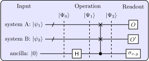

# Ze-Hao Huang's Homepage

    

- Name: Ze-Hao Huang (黄泽豪)
- Affiliation: [National Laboratory of Solid State Microstructures](https://vlssm.nju.edu.cn/main.htm) and [School of Physics](https://physics.nju.edu.cn/), [Nanjing University](https://www.nju.edu.cn/)
- Position: PhD candidate
- Supervisor: [Shi-Liang Zhu (朱诗亮)](https://physics.scnu.edu.cn/a/20201218/6945.html)
- E-mail: [huang.zehao@outlook.com](mailto:huang.zehao@outlook.com)
- [GitHub](https://github.com/zhhuang98)
 | [ORCID](https://orcid.org/0000-0002-1180-7673)
 | [arXiv](https://arxiv.org/a/huang_z_3.html)
 | [Google Scholar](https://scholar.google.cz/citations?hl=zh-CN&pli=1&user=Guq9h6AAAAAJ)
 | [ResearchGate](https://www.researchgate.net/profile/Ze-Hao-Huang)

## About me

- Ze-Hao Huang is a PhD candidate of Physics at Nanjing University.
- He was born and grew up in Nanchang City, Jiangxi Province, China.
- He received B.Sc. degree in Physics and Computer Science & Technology from Nanchang University in 2019.
- He was graduated from the Class of the Gifted Young (5-Year coherent middle/high school) at Nanchang No.10 Middle School.
- His research focuses on the study of quantum simulation of (1) topological quantum matters, especially for them in non-Hermitian systems, (2) quantum many-body systems, and (3) quantum foundations.

## Research Interests

Broadly speaking, he is interested in the research of the intersection of `physics` and `quantum information (computing)`, `machine learning`, and `modern mathematics`, such as
- Condensed Matter Physics + Quantum Information -> Quantum Simulation
    > Status: Main Direction during my PhD. Some articles have been published.
- Condensed Matter Physics + Machine Learning -> Quantum Machine Learning
    > Status: Accumulating background knowledge ......
- Quantum Information + Topology (Geometry) -> Quantum Information Geometry, Geometry of Quantum Computation (Complexity)
    > Status: Looking for a specific question ......

<!-- Currently, he tries to design some experimental schemes based on weak-value measurement techniques for verifying novel quantum phenomena. -->

## Publications

1. **Ze-Hao Huang**, Peng He, Li-Jun Lang\*, Shi-Liang Zhu\*, *Quantum circuit for measuring an operator's generalized expectation values and its applications to non-Hermitian winding numbers*, [Physical Review A **107**, 052205 (2023)](https://journals.aps.org/pra/abstract/10.1103/PhysRevA.107.052205).
\[[PDF](papers/PhysRevA.107.052205.pdf)\]
\[[arXiv](https://arxiv.org/abs/2210.12732)\]

    

2. Peng He\*, **Ze-Hao Huang**, *Floquet engineering and simulating exceptional rings with a quantum spin system*, [Physical Review A **102**, 062201 (2020)](https://journals.aps.org/pra/abstract/10.1103/PhysRevA.102.062201). 
\[[PDF](papers/PhysRevA.102.062201.pdf)\]
\[[arXiv](https://arxiv.org/abs/2005.02703)\]

### Last Modified
May 26, 2024
